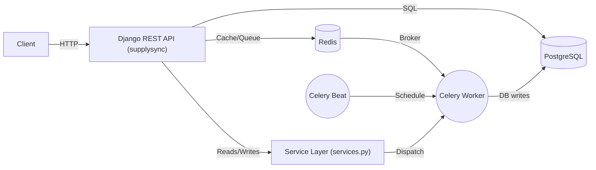
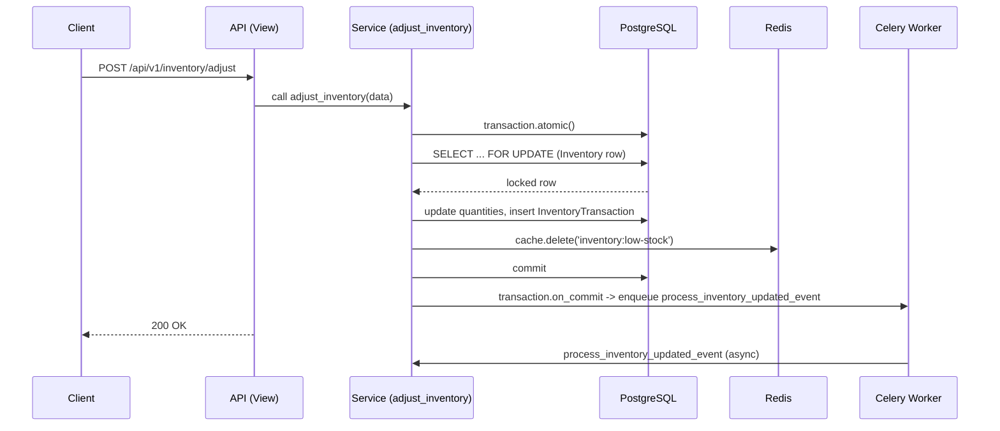

# SupplySync — Inventory & Order Management Backend

An enterprise-grade backend for multi-warehouse inventory and order management, implemented with Django, Django REST Framework, Celery, Redis, and PostgreSQL. This repository contains a production-ready backend focused on data integrity, concurrency safety, background processing, and observability.

Key highlights:
- Service-layer architecture (no business logic in views)
- Row-level locking and transactional safety (`select_for_update()`)
- Redis caching patterns and TTLs for hot endpoints
- Celery background tasks and scheduled jobs (Celery Beat)
- JWT authentication with role-based access control

## Table of Contents
- Project overview
- Tech stack
- Repository layout
- System architecture & execution flows (Mermaid diagrams)
- Local development & Docker
- Running tests and CI notes
- API docs and endpoints
- Contributing & support

---

## Project overview

SupplySync is designed to manage inventory across multiple warehouses, process purchase and sales orders, and provide analytics and alerts. The backend ensures correctness under concurrent access using database transactions and background workers for side-effects.

## Tech stack

- Python 3.11+ / 3.13 compatible
- Django 5.x
- Django REST Framework 3.15.x
- PostgreSQL 15 (primary schema: `supplysync`)
- Redis 7 (cache + Celery broker)
- Celery (workers) & django-celery-beat (scheduler)
- drf-spectacular (OpenAPI)
- pytest, pytest-django (testing)

---

## Code structure

Top-level layout (root):

```
.
├── manage.py
├── docker-compose.yml
├── requirements.txt
├── .env.example
├── supplysync/                # Django project settings & WSGI
│   ├── settings/
│   │   ├── base.py
│   │   ├── development.py
│   │   ├── production.py
│   │   └── testing.py
│   ├── celery.py
│   ├── urls.py
│   └── wsgi.py
├── apps/                      # Django apps (service layer implementations)
│   ├── accounts/
│   ├── warehouses/
│   ├── categories/
│   ├── products/
│   ├── inventory/
│   ├── suppliers/
│   ├── purchase_orders/
│   ├── sales_orders/
│   └── reports/
├── core/                      # shared utilities, constants, exceptions
└── tests/                     # pytest tests
```

Each app follows the pattern:
- `models.py` — ORM models (all inherit from `core.models.BaseModel` unless append-only)
- `serializers.py` — DRF serializers (validation only)
- `services.py` — Business logic, transactional boundaries, caching, and Celery dispatch
- `tasks.py` — Celery tasks for background processing
- `views.py` / `urls.py` — Thin HTTP layer that delegates to services

---

## System architecture & execution flows

High-level architecture (components): web API (Django) -> PostgreSQL (data) -> Redis (cache & broker) -> Celery workers



Inventory adjustment flow (simplified):



Why `select_for_update()`?
- It acquires a row-level lock in the database so concurrent transactions serialize their modifications. Without it, two requests could read the same available quantity and both succeed, causing overselling or negative stock.

---

## Run locally (quickstart)

1. Start infrastructure (Docker):

```bash
docker-compose up -d
```

2. Create & activate virtual environment, install Python deps:

```bash
python -m venv .venv
# Windows PowerShell
.\.venv\Scripts\Activate.ps1
pip install -r requirements.txt
```

3. Copy environment variables and configure `.env` (optional):

```bash
cp .env.example .env
# Edit .env to set SECRET_KEY and any other secrets
```

4. Run migrations:

```bash
python manage.py migrate
```

5. (Optional) Create superuser:

```bash
python manage.py createsuperuser
```

6. Start server:

```bash
python manage.py runserver
```

7. Open API docs:

- Swagger UI: `http://localhost:8000/api/schema/swagger-ui/`
- ReDoc: `http://localhost:8000/api/schema/redoc/`

---

## Tests

Run the full test suite with:

```bash
python -m pytest -q
```

The testing settings use SQLite and set Celery to eager mode so tests run deterministically without Docker.

---

## Developer workflow & code practices

- Services contain all business logic: use functions in `apps/*/services.py` to mutate DB, orchestrate cache invalidation, and enqueue Celery tasks with `transaction.on_commit()`.
- Use `select_for_update()` in services for row-level locking.
- Cache keys and TTLs are defined centrally in `core/constants.py`.
- All API responses follow the unified error format via `core.exceptions.custom_exception_handler`.

---

## API overview (examples)

- Auth: `POST /api/v1/auth/register/`, `POST /api/v1/auth/login/`, `POST /api/v1/auth/logout/`
- Warehouses: `GET /api/v1/warehouses/`, `POST /api/v1/warehouses/`
- Inventory: `POST /api/v1/inventory/adjust/`, `POST /api/v1/inventory/transfer/`, `GET /api/v1/inventory/low-stock/`
- Purchase Orders: `POST /api/v1/purchase-orders/`, `POST /api/v1/purchase-orders/<id>/approve/`
- Sales Orders: `POST /api/v1/sales-orders/`, `POST /api/v1/sales-orders/<id>/dispatch/`

Refer to the OpenAPI schema for full contract details.

---

## Contributing

Please open an issue or submit a pull request. Follow the repo's coding style, write tests for new features, and avoid business logic in views or serializers.

---

## License & credits

This project template is provided as-is for the SupplySync assessment.
