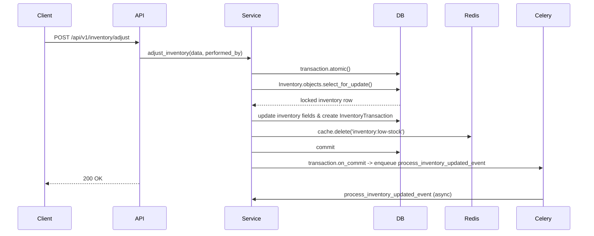
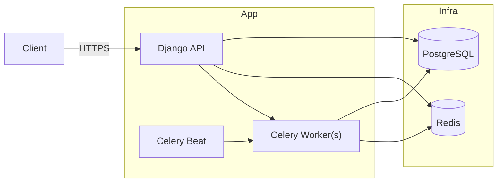

# SupplySync — Architecture

This document describes the system architecture, design rationales, and deployment considerations for the SupplySync Inventory and Order Management Platform.

## 1. Purpose
SupplySync centralizes inventory management across multiple warehouses, ensures data integrity under high concurrency, automates purchase/sales order lifecycles, and provides reporting and alerts.

## 2. High-level components
- Django REST API (`supplysync` project)
- PostgreSQL (primary relational store; schema `supplysync`)
- Redis (cache and Celery broker)
- Celery workers (background processing)
- Celery Beat (periodic tasks scheduler)
- Clients (web dashboards, mobile apps, third-party integrators)

## 3. Component responsibilities
- Web/API: authentication, request parsing, response formatting. Delegates all business logic to service layer functions in `apps/*/services.py`.
- Service Layer: transactional operations, cache management, task enqueuing, business rules and validations.
- Celery Tasks: event processing, retries, periodic maintenance, and downstream side effects.
- Database: storage of canonical data and append-only transactional audit logs (`InventoryTransaction`).
- Redis: hot caches (product detail, low-stock lists), rate-limiting counters, PO daily sequence counters.

## 4. Execution flows

### 4.1 Inventory Adjustment (detailed)

### 4.2 Purchase Order creation (PO number generation)
- PO number format: `PO-<YYYYMMDD>-<4-digit-seq>`
- Sequence via Redis key: `po-sequence:<YYYYMMDD>` with TTL 86400 seconds.
- Use `cache.add()` to initialize to 0 atomically, then `cache.incr()` to get the next sequence.

## 5. Concurrency and Locking
- For all inventory-mutation workflows we use `select_for_update()` inside `transaction.atomic()` blocks.
- When updating multiple inventory rows (transfers) we lock rows in a deterministic order (e.g., sorted warehouse IDs) to avoid deadlocks.
- InventoryTransaction is append-only (no updates, no soft-delete) to preserve auditability.

## 6. Caching strategy
- Cache keys and TTLs are declared in `core/constants.py`.
- Services read/write cache; views do not access cache directly.
- Invalidation rules:
  - `inventory:low-stock`: invalidated on any inventory change and periodically by Celery every 5 minutes.
  - `products:detail:{id}`, `products:list`: invalidated on product create/update/delete.
  - `categories:tree`: invalidated on category changes.
  - `reports:dashboard`: invalidated when underlying metrics change.

## 7. Background processing
- Celery tasks are defined in `apps/*/tasks.py` and decorated with `@shared_task(bind=True, max_retries=3)` where retries are required.
- Idempotency: tasks should be written to be safe to run multiple times (e.g., using transactions, checking existing state).
- Celery Beat schedules periodic tasks such as cache invalidation and daily summaries.

## 8. Authentication & Authorization
- JWT (Simple JWT) for stateless auth. Token blacklisting enabled.
- Custom `User` model with `role` field and `UserRole` choices.
- RBAC implemented in `core/permissions.py` with descriptive messages for failures.

## 9. Observability
- Logging: module-level loggers using `logging.getLogger(__name__)`.
- Events: Celery tasks log high-level events (inventory-updated, purchase-order-received, sales-order-created).
- Errors: unified error format via `core.exceptions.custom_exception_handler`.

## 10. Deployment notes
- The repo includes a `docker-compose.yml` for PostgreSQL, Redis, Celery worker, and Celery Beat. The Django web app runs outside Compose (developer may run locally or containerize separately).
- In production, configure environment variables and secrets in the environment or secret manager; do not use `.env` in version control.
- Use connection pooling and tune PostgreSQL and Redis for concurrency.

## 11. Security considerations
- Password policies enforced via `apps/accounts/validators.py`.
- Rate-limiting on failed login attempts using Redis.
- Avoid exposing internal error details in production; custom exception handler returns safe messages.

## 12. Diagram (deployment view)

## 13. Appendix: files of interest
- `core/models.py`, `core/exceptions.py`, `core/constants.py`, `core/throttles.py`
- `apps/inventory/services.py`, `apps/inventory/tasks.py`
- `apps/purchase_orders/services.py`, `apps/sales_orders/services.py`
- `supplysync/celery.py`, `docker-compose.yml`

